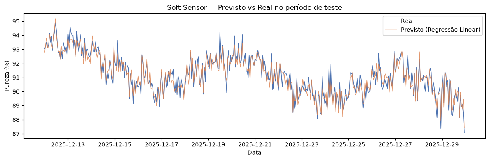

# Soft Sensor Industrial — Estimativa de Pureza com Séries Temporais

Projeto de ciência de dados aplicado à indústria: um **soft sensor** que estima a
pureza de um produto em uma coluna de destilação a partir de sensores baratos
(temperatura, pressão, vazão), usando Python e scikit-learn.

## O problema

Em colunas de destilação industriais, medir a **pureza do produto** exige análise de
laboratório — cara e lenta. Sensores de temperatura, pressão e vazão, por outro lado,
são baratos e medem continuamente.

Um **soft sensor** é um modelo de ML que estima a variável cara (pureza) a partir das
variáveis baratas, em **tempo real**, substituindo o laboratório.

## Resultados

| Modelo | MAE | RMSE | R² |
|---|---|---|---|
| **Regressão Linear** | **0.316** | **0.399** | **0.917** |
| Gradient Boosting | 0.388 | 0.485 | 0.877 |
| Random Forest | 0.487 | 0.608 | 0.807 |
| Baseline (lab a cada 8h) | — | — | — |

O modelo explica **91.7% da variação da pureza** — superando o baseline operacional
(última medição de laboratório repetida a cada 8 horas).



## Decisões técnicas

- **Split temporal** (não aleatório): treino = passado, teste = futuro. Embaralhar
  vazaria informação do futuro para o treino, inflando artificialmente as métricas.
- **Interpolação por tempo** nos faltantes: preserva a continuidade física do processo,
  diferente da média que ignora a ordem temporal.
- **Lags e janelas móveis**: dão ao modelo memória do processo — o estado atual depende
  das horas anteriores (inércia térmica).
- **Regressão Linear ganhou**: a relação entre as features e a pureza é predominantemente
  linear após a engenharia de features. Modelos mais complexos sofreram overfitting.

## Por que é série temporal?

Os dados chegam ordenados no tempo (1 leitura/hora) e o estado atual do processo
depende do passado recente. Além disso, há:

- **Tendência:** incrustação (*fouling*) degrada a separação ao longo dos dias
- **Sazonalidade:** ciclo diário de temperatura ambiente afeta o processo
- **Dados faltantes:** sensores falham — tratamento especial necessário

## Stack

Python · pandas · scikit-learn · matplotlib · seaborn

## Setup

```bash
pip install -r requirements.txt
python dados/gerar_dados.py
```

## Estrutura

```
soft-sensor-pureza/
├── dados/gerar_dados.py       # gerador do dataset sintético
├── meu_trabalho/
│   ├── 01_explorar.py         # séries temporais e autocorrelação
│   ├── 02_eda.py              # EDA e matriz de correlação
│   ├── 03_faltantes.py        # tratamento de dados faltantes
│   ├── 04_features.py         # engenharia de features temporais
│   ├── 05_split.py            # split temporal
│   ├── 06_modelos.py          # modelagem e métricas
│   └── 07_avaliacao.py        # avaliação e gráficos
├── modulos/                   # teoria de cada módulo
└── outputs/                   # gráficos gerados
```
